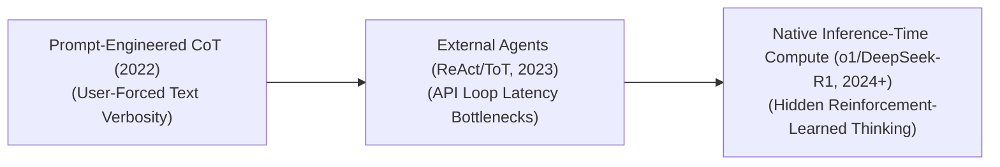

# Awesome-Reasoning-Models
## Reasoning Models: Evolution, Variants, Types, & Applications

Reasoning Models represent a fundamental paradigm shift in Large Language Models (LLMs), moving past rapid next-token intuition toward deliberative, systemic thinking. While traditional language models excel at pattern matching and fluid surface-level generation (System 1 thinking), reasoning models natively implement multi-step cognitive structures, self-correction pathways, and search algorithms (System 2 thinking). This architectural shift enables models to systematically break down, verify, and execute highly complex mathematics, software engineering tasks, and long-horizon scientific logic.

---

## 1. The Chronological Evolution

The architectural progression of reasoning models reflects a shift from external prompting heuristics over standard text bases to natively integrated, reinforcement-learned thinking loops.

| Era | Concept | Limitation / Significance | Year | Original Paper |
|---|---|---|---|---|
| **The Prompt-Engineered CoT Era (~2022–2023)** | Unlocked by manually appending phrases like `"Let's think step-by-step"` to prompts (Chain-of-Thought). The model uses its standard next-token prediction window to lay out intermediary logical milestones textually. | Reliant on user prompting skills; the model cannot dynamically alter its logic path if it initiates the token stream with a calculation error. | 2022 | [Chain-of-Thought Prompting Elicits Reasoning in Large Language Models](https://arxiv.org/abs/2201.11903) |
| **The External Agentic Search Era (~2023–2024)** | Wrapped standard base LLMs inside programmatic frameworks like **ReAct** (Reason+Act), **Tree-of-Thoughts (ToT)**, or **Graph-of-Thoughts**. External Python loops force the model to branch out multiple candidate choices, vote on the best path, and call local sandbox APIs. | Heavy API overhead, extreme multi-turn token costs, and high engineering latency. | 2022 | [ReAct: Synergizing Reasoning and Acting in Language Models](https://arxiv.org/abs/2210.03629) |
| **The Native Inference-Time Compute Era (~2024–Present)** | Formally established by frontier architectures like OpenAI's **o1/o3** series and DeepSeek's **DeepSeek-R1**. These models undergo massive Large-Scale Reinforcement Learning (RL) targeting raw thinking structures. | The model generates a hidden, structured reasoning sequence before outputting its final answer, dynamically scaling its "thinking time" to match the mathematical difficulty of the problem. | 2024 | [Learning to Reason with LLMs (OpenAI o1)](https://openai.com/index/learning-to-reason-with-llms/) |

---

## 2. Structural & Optimization Variants

Reasoning behavior is baked into modern models using distinct data generation, structural filtering, and reinforcement learning strategies.

| Variant | Mechanism | Behavior / Pros | Year | Original Paper |
|---|---|---|---|---|
| **Pure RL-Driven Reasoning (Cold Start Free)** | Trains a base model purely through automated Reinforcement Learning reward signals (like rule-based compilers or math verifiers) without feeding it initial human demonstrations. | The model organically discovers advanced human-like cognitive structures—such as self-correction, back-tracking, and alternative hypothesis testing—purely to maximize its reward. | 2025 | [DeepSeek-R1: Incentivizing Reasoning Capability in LLMs via Reinforcement Learning](https://arxiv.org/abs/2501.12948) |
| **SFT + RL Hybrid Reasoning** | Collects or synthetically generates a high-quality "cold-start" dataset of long-form human reasoning paths. The model undergoes Supervised Fine-Tuning (SFT) first to adopt a clean markdown thinking style, followed by RL to scale up logical precision. | - | 2025 | [DeepSeek-R1: Incentivizing Reasoning Capability in LLMs via Reinforcement Learning](https://arxiv.org/abs/2501.12948) |
| **Distilled Reasoning Models** | Transfers complex thinking behaviors from a massive frontier model down into a lightweight, open-source model (e.g., distilling DeepSeek-R1 into Llama-3-8B). | Lowers infrastructure hosting barriers, allowing compact edge models to mimic advanced reasoning structures without undergoing multi-million dollar RL training runs. | 2025 | [DeepSeek-R1: Incentivizing Reasoning Capability in LLMs via Reinforcement Learning](https://arxiv.org/abs/2501.12948) |

---

## 3. Inference Search & Verification Frameworks

These variants dictate how a model explores the multi-step solution space during computation blocks.

| Framework | Mechanism | Pros | Year | Original Paper |
|---|---|---|---|---|
| **Monte Carlo Tree Search (MCTS) Integration** | Pairs the transformer with a classic tree-search algorithm. The model acts as the policy/value network, mapping out paths, predicting downstream success probabilities, and backtracking if a leaf node hits a dead-end. | - | 2023 | [Tree of Thoughts: Deliberate Problem Solving with Large Language Models](https://arxiv.org/abs/2305.10601) |
| **Process-Supervised Reward Models (PRMs)** | Replaces classic Outcome Reward Models (ORMs, which score only the final answer) with fine-grained verifiers that score *every individual intermediate reasoning step*. | Drastically reduces logical hallucinations by catching and penalizing deceptive or broken logic early in the thinking chain. | 2023 | [Let's Verify Step by Step](https://arxiv.org/abs/2305.20050) |
| **Majority Voting / Self-Consistency** | Generates a diverse cluster of independent reasoning paths simultaneously at a high decoding temperature, executing a token-level statistical vote to select the most recurring conclusion. | - | 2022 | [Self-Consistency Improves Chain of Thought Reasoning in Language Models](https://arxiv.org/abs/2203.11171) |

---

## 4. Specialized Real-World Applications

| Application | Details | Year | Original Paper |
|---|---|---|---|
| **Autonomous Software Engineering & Code Compilation** | Solves long-horizon software engineering benchmarks (like SWE-bench). The model reasons through massive, multi-file codebases, mentally executes mock runtime tests, identifies breaking syntax dependencies, and refactors code iteratively before committing changes. | 2023 | [SWE-bench: Can Language Models Resolve Real-World GitHub Issues?](https://arxiv.org/abs/2310.22752) |
| **Advanced Cryptographic & Mathematical Theorem Proving** | Solves multi-step competitive math Olympiad problems. The model maps abstract properties into symbolic equations, checks for identity rule violations, and pivots to alternative mathematical frameworks if an initial proof vector collapses. | 2022 | [Minerva: Solving Quantitative Reasoning Problems with Language Models](https://arxiv.org/abs/2206.14858) |
| **De Novo Bio-Chemical Pathway Synthesis** | Models complex multi-turn molecular interactions for targeted drug design. Reasoning models step through potential molecular configurations, ensuring chemical stability constraints and toxicity boundaries are rigorously accounted for across the simulated synthesis chain. | 2023 | [ChemCrow: Augmenting large-language models with chemistry tools](https://arxiv.org/abs/2304.05376) |
