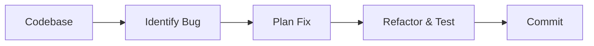

# Autonomous Software Engineering & Code Compilation

[Back to README](../README.md)

## Detailed Overview
Reasoning models can navigate multi-file codebases, simulate tests mentally, identify dependencies, and iteratively refactor code, solving complex engineering benchmarks.

## Diagram

