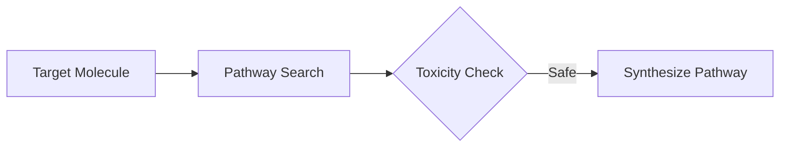

# De Novo Bio-Chemical Pathway Synthesis

[Back to README](../README.md)

## Detailed Overview
Reasoning models can step through potential molecular configurations, accounting for chemical stability, constraints, and toxicity boundaries during synthesis simulation.

## Diagram

