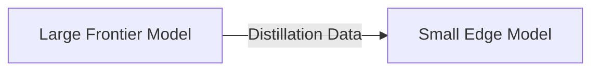

# Distilled Reasoning Models

[Back to README](../README.md)

## Detailed Overview
These models transfer complex reasoning capabilities from massive frontier models into smaller, more efficient architectures, often through knowledge distillation techniques.

## Diagram

