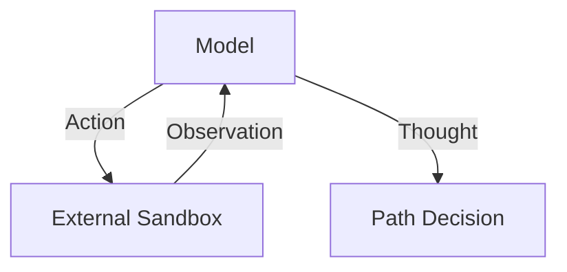

# External Agentic Search Era (~2023–2024)

[Back to README](../README.md)

## Detailed Overview
External agentic search involves wrapping base LLMs in frameworks like ReAct, Tree-of-Thoughts, or Graph-of-Thoughts. This allows the model to interact with external tools and search through multiple logical paths.

## Diagram

