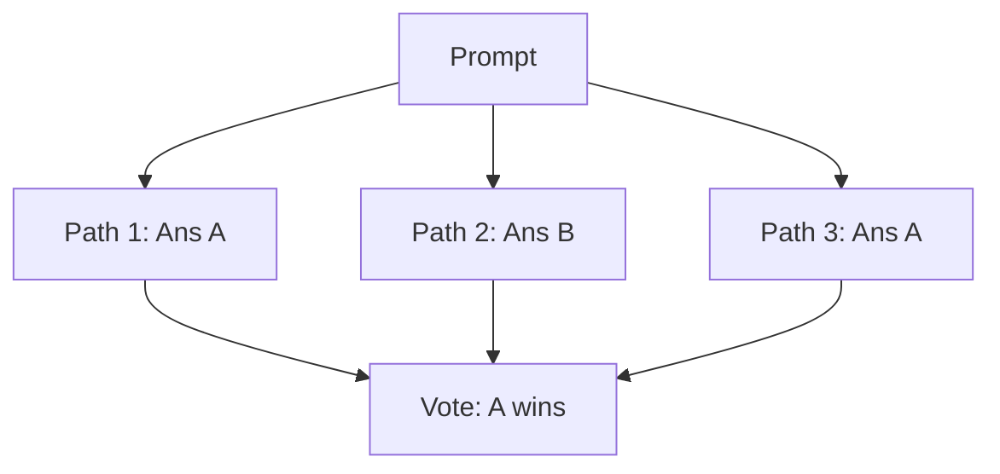

# Majority Voting / Self-Consistency

[Back to README](../README.md)

## Detailed Overview
By generating multiple independent reasoning paths at higher temperatures and voting on the final answers, models significantly improve their reliability and accuracy.

## Diagram

