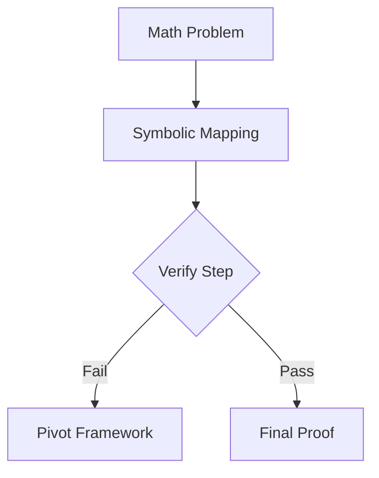

# Advanced Cryptographic & Mathematical Theorem Proving

[Back to README](../README.md)

## Detailed Overview
These models abstract mathematical problems into symbolic equations, checking rule violations, and exploring alternative mathematical spaces to form rigorous proofs.

## Diagram

