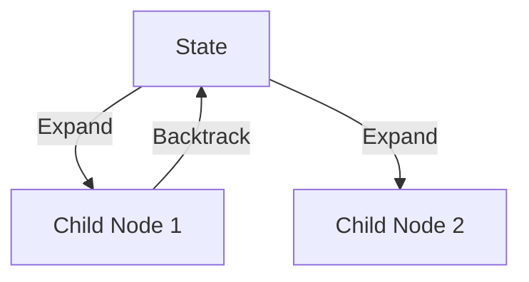

# Monte Carlo Tree Search (MCTS) Integration

[Back to README](../README.md)

## Detailed Overview
Pairing language models with MCTS allows the generation of multiple potential reasoning paths, predicting success probabilities, and backtracking when encountering dead ends.

## Diagram

