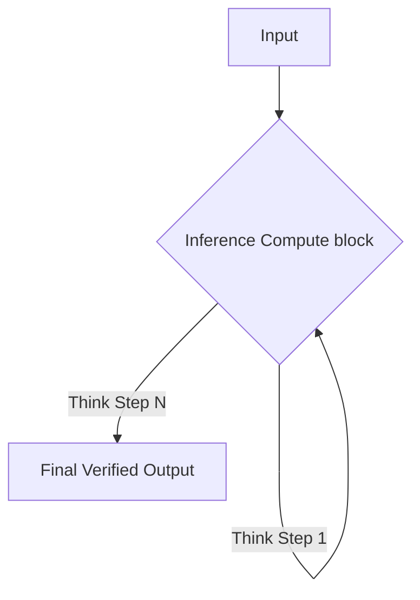

# Native Inference-Time Compute Era (~2024–Present)

[Back to README](../README.md)

## Detailed Overview
Models like OpenAI's o1 and DeepSeek-R1 have reasoning structures integrated natively. They use internal reinforcement learning and allocate compute at inference time to 'think' dynamically based on problem difficulty.

## Diagram

