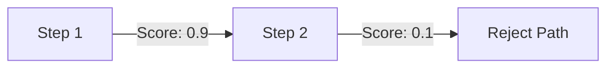

# Process-Supervised Reward Models (PRMs)

[Back to README](../README.md)

## Detailed Overview
PRMs evaluate the quality of intermediate reasoning steps rather than just the final answer, penalizing logical errors early and reducing hallucinations.

## Diagram

