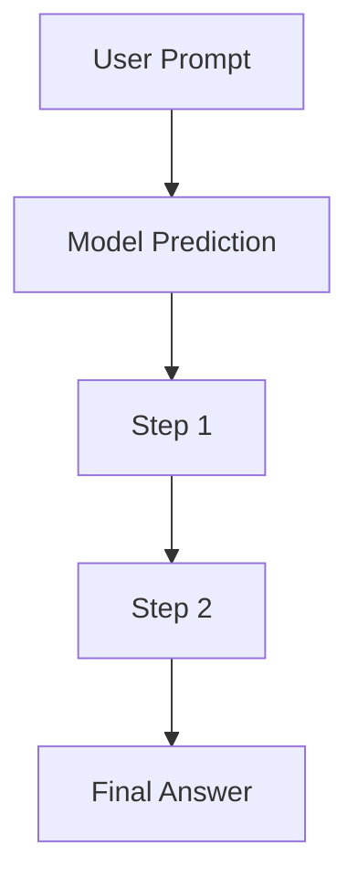

# Prompt-Engineered CoT Era (~2022–2023)

[Back to README](../README.md)

## Detailed Overview
Chain-of-Thought (CoT) prompting revolutionized the way language models solve complex problems by forcing them to emit intermediate reasoning steps before answering.

## Diagram

