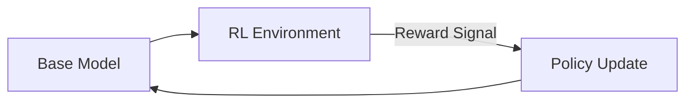

# Pure RL-Driven Reasoning (Cold Start Free)

[Back to README](../README.md)

## Detailed Overview
This approach trains base models purely using automated Reinforcement Learning reward signals, skipping initial human demonstrations. The model organically discovers complex problem-solving strategies.

## Diagram

