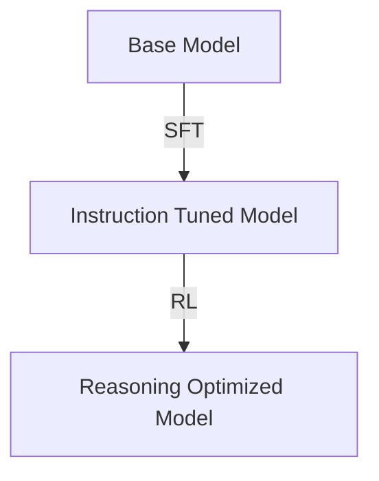

# SFT + RL Hybrid Reasoning

[Back to README](../README.md)

## Detailed Overview
A hybrid approach that combines Supervised Fine-Tuning (SFT) with Reinforcement Learning (RL). SFT initializes the model with a good 'thinking' template, and RL scales the logical precision.

## Diagram

